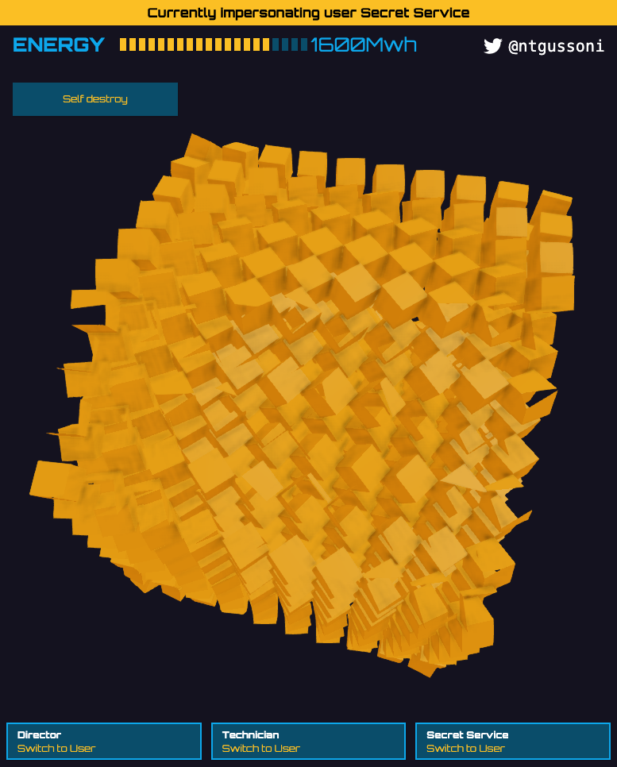

# **Blitz Guard demo for the Blitz.js meetup**

## Getting Started

Run your app in the development mode.

```
blitz start
```

## Seed data

Run your app in the development mode.

```
blitz db seed
```

## Login

`Username: director@example.com`

`Password: password1234`

## Tests

Runs your tests using Jest.

```
blitz test
or
yarn test
```

Blitz comes with a test setup using [Jest](https://jestjs.io/) and [react-testing-library](https://testing-library.com/).
